<h1 align='center'> Dardos Blogs </h1>
<h3 align='center'> By Osama Alhyari </h3>

**[🏃‍♂️ Run This Project](https://github.com/osama-alhyari/BlogWebsite?tab=readme-ov-file#-run-this-project)•[📈 Entity Relationship Diagram](https://github.com/osama-alhyari/BlogWebsite?tab=readme-ov-file#-entity-relationship-diagram)•[📺 Views](https://github.com/osama-alhyari/BlogWebsite?tab=readme-ov-file#-views)**

# 🏃‍♂️ Run This Project
Prerequisites to running this project : PHP , Composer , Node.js , NPM , A php development enviroment like XAMPP. A MySQL server : MySql Workbench or PhpMyAdmin will work.

1) First you want to clone this project into a directory.

2) Open a terminal, and navigate into the MasterPiece folder in the directory you cloned this repo to.

3) You need to run the following commands to install project dependencies:     
   `composer install`    
   `npm install `    
   
4) Run the following command to create your .env file:      
   `copy .env.example .env`
   
5) Go to your new .env file and change the following variables:     
   `DB_CONNECTION=mysql`    
   `DB_HOST= 127.0.0.1` ( Insert The Database Host )     
   `DB_PORT= 3306 ` ( Insert Your Database Port )      
   `DB_DATABASE= ` ( Insert Your Database Name ) You can name this whatever suits you, but you would have to create an empty database with the same name.     
   `DB_USERNAME= root`( Insert Your Database UserName )     
   `DB_PASSWORD= `( Insert Your Database Password )     

7) Generate an app encryption key, run the following command :      
   `php artisan key:generate`

8) Migrate the database using the following command :      
   `php artisan migrate`

9) Seed the database : ( This will provide 2 users and some posts and comments )       
   `php artisan db:seed`

   The users credentials are : admin@example.com & user@example.com       
   The password for both users is 11111111

10) Run the final command to start the server:        
   `php artisan serve`

# 📈 Entity Relatshionship Diagram
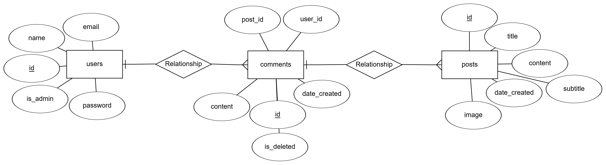

# 📺 Views

## 🖥️ Desktop
<h6 align='center'> Admin Landing </h6>

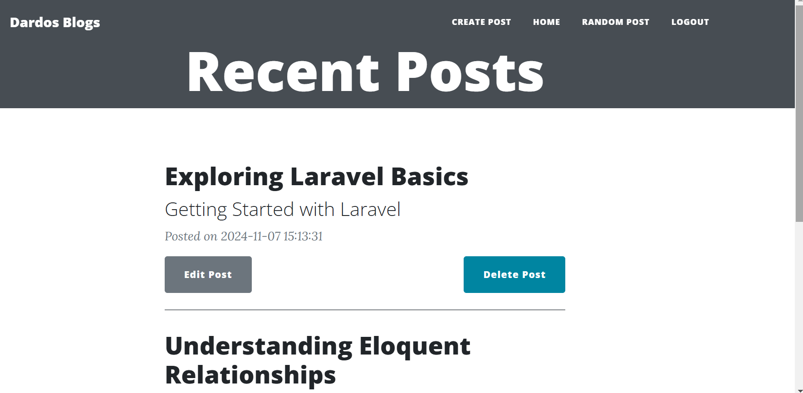

<h6 align='center'> User Landing </h6>

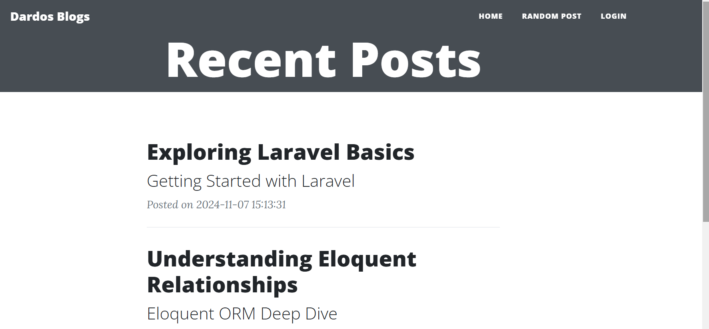

<h6 align='center'> Post </h6>

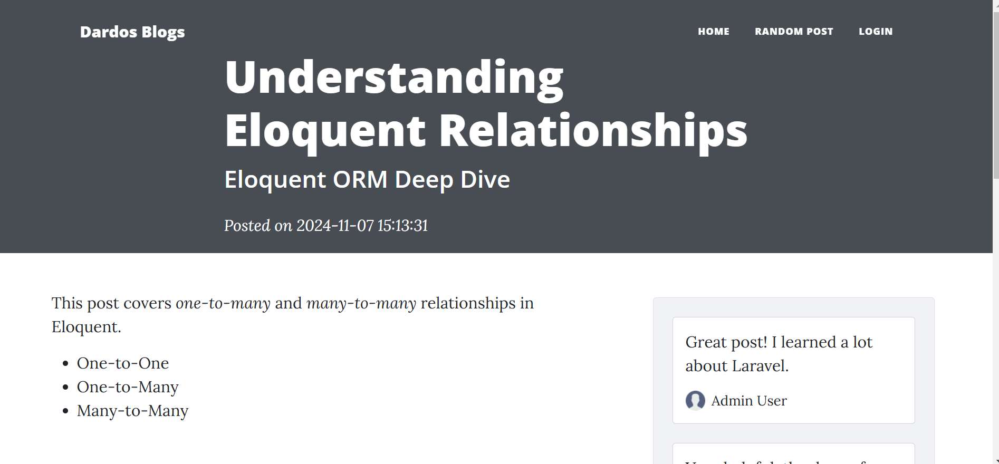

<h6 align='center'>Admin Edit Post </h6>

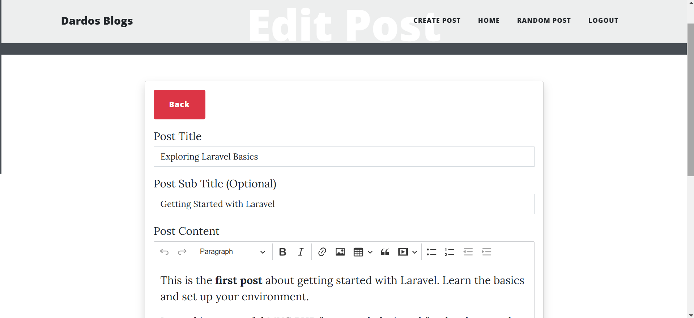

<h6 align='center'>Post With A Post Image</h6>

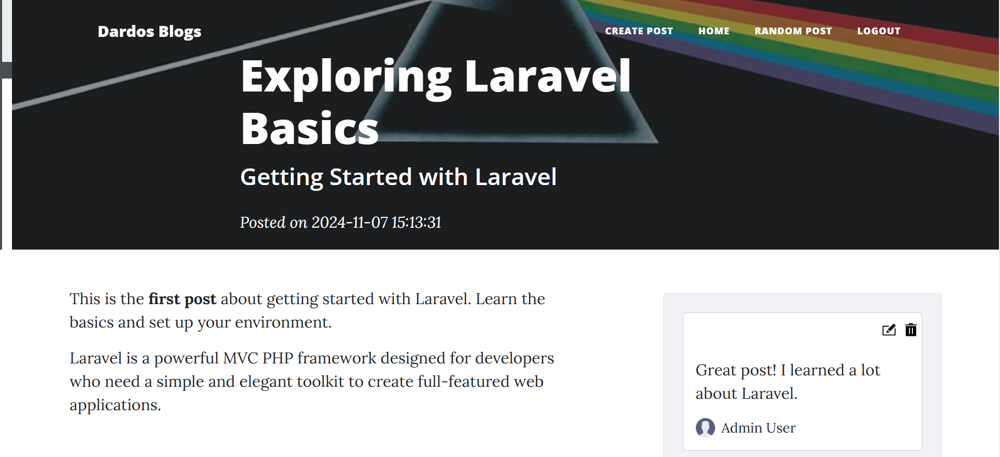

## 📱 Mobile
<h6 > Admin Landing </h6>

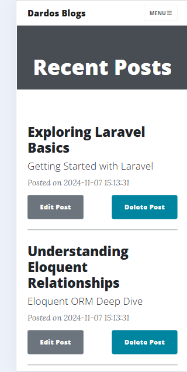

<h6 > User Landing </h6>

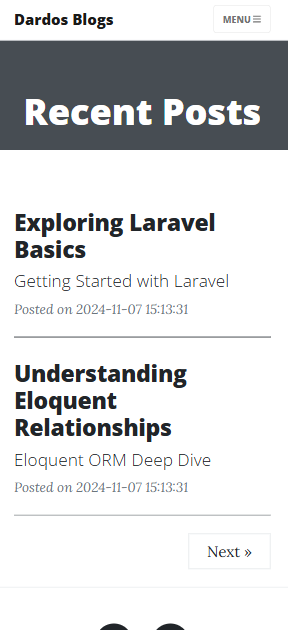

<h6 > Post </h6>

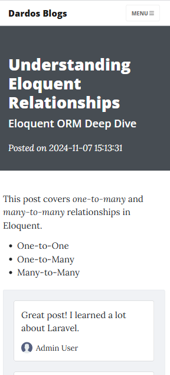

<h6 >Admin Edit Post </h6>

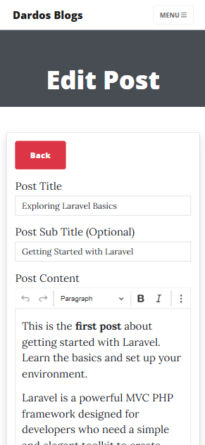

<h6 >Post With A Post Image</h6>

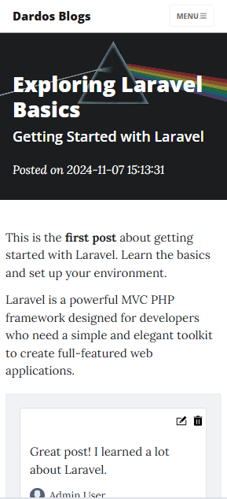

